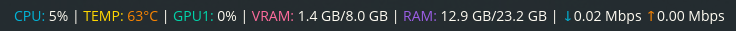

# System Stats Applet for COSMIC Desktop

A lightweight system monitoring applet for the COSMIC desktop environment.



## Features

- CPU usage monitoring
- Memory usage display
- Network upload/download speeds
- CPU temperature
- GPU temperature

## Dependencies

Building requires `just` and `libxkbcommon-dev`

## Installation

### Build and Install

```bash
just build-release
sudo just install
```

### From Package

**.deb package:**
```bash
sudo dpkg -i cosmic-applet-systemstats_1.0.0-1_amd64.deb
```

**.flatpak package:**
```bash
flatpak install --user cosmic-applet-systemstats.flatpak
```

<!-- ### From Flathub
```bash
flatpak install flathub io.github.rylan_x.cosmic-applet-systemstats
```
-->

<!-- ### From COSMIC Store
Find "System Stats" in the COSMIC Store under COSMIC Applets.
-->

## Configuration

The applet can be configured via `~/.config/systemstats/config.toml`. A default configuration file is automatically created.

### Configuration Options

```toml
# Refresh interval in milliseconds (default: 1000 = 1 second)
refresh_interval_ms = 1000

[monitors]
# Toggle individual monitors on/off (default: all true)
cpu_usage = true
cpu_temperature = true
gpu_temperature = true
memory = true
network = true

[thresholds.cpu]
# CPU usage thresholds (percentage)
# Values < low_max = Low (green)
# Values between low_max and high_min = Medium (yellow)
# Values >= high_min = High (red)
low_max = 40.0
high_min = 75.0

[thresholds.memory]
# Memory usage thresholds (percentage)
low_max = 50.0
high_min = 80.0

[thresholds.temperature]
# Temperature thresholds (Celsius)
low_max = 60.0
high_min = 80.0
```

After editing the config file, restart the applet/panel for changes to take effect.

## Color-Coded Status Indicators

The applet uses color coding to provide at-a-glance status information:

| Status | Color | CPU Usage | Memory Usage | Temperature |
|--------|-------|-----------|--------------|-------------|
| Low | Green | < 40% | < 50% | < 60°C |
| Medium | Yellow | 40-75% | 50-80% | 60-80°C |
| High | Red | > 75% | > 80% | > 80°C |

Network speeds are displayed with:
- **Download** speed in green
- **Upload** speed in amber

Thresholds can be customized in the configuration file to match your preferences.
